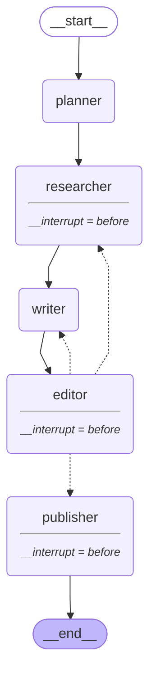

# LangGraph Workflow Diagram

```mermaid
---
config:
  flowchart:
    curve: linear
---
graph TD;
	__start__([<p>__start__</p>]):::first
	planner(planner)
	researcher(researcher<hr/><small><em>__interrupt = before</em></small>)
	writer(writer)
	editor(editor<hr/><small><em>__interrupt = before</em></small>)
	publisher(publisher<hr/><small><em>__interrupt = before</em></small>)
	__end__([<p>__end__</p>]):::last
	__start__ --> planner;
	editor -.-> publisher;
	editor -.-> researcher;
	editor -.-> writer;
	planner --> researcher;
	researcher --> writer;
	writer --> editor;
	publisher --> __end__;
	classDef default fill:#f2f0ff,line-height:1.2
	classDef first fill-opacity:0
	classDef last fill:#bfb6fc

```